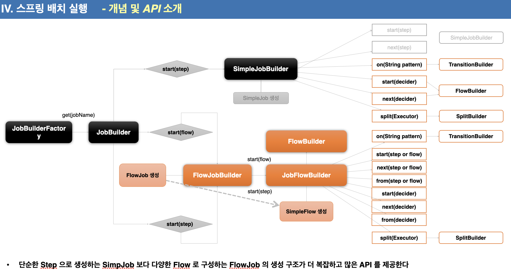

# Job
## 배치 초기화 설정
### JobLauncherApplicationRunner
- Spring Batch 작업을 시작하는 ApplicationRunner , BatchAutoConfiguration 에서 생성됨
- 스프링부트에서 제공하는 ApplicationRunner 의 구현체로 애플리케이션이 정상적으로 구동되자마자 실행됨
- 기본적으로 빈으로 등록한 모든 Job을 실행시킴
- 만약 여러 Job 중 실행시키고자 하는 Job 이 있다면 그 Job 만 실행시킬 수 있음
### BatchProperties
- Spring Batch 의 환경 설정 클래스
- Job 이름 스키마 초기화 설정 테이블 Prefix 설정
- application.properties 
  - batch.job.names : 

```
spring:
  batch:
    job: 
      names: ${job.name:NONE}
      enabled: true   
    jdbc:
      initialize-schema: always
      tabvle-prefix: SYSTEM_
```
### Job 실행 옵션
- 지정한 Batch Job 만 실행
  - spring.batch.job.names=simplejob
  - 애플리케이션 실행 시 Program Arguments 로 job 이름 입력
    - job.name=hellojob,simplejob
- 동시에 두개의 배치 잡을 실행시킬 수 있는가 ? - ㅇㅇ

## JobBuilderFactory vs JobBuilder
- 스프링 배치는 job 과 Step 을 쉽게 생성 및 성장할 수 있도록 util 성격의 빌더 클래스들을 제공함
- JobBuilderFactory
  - JobBuilder 를 생성하는 팩토리 클래스 - get(String name) 메소드 제공˚
  - JobBuilderFactory.get("jobName")
    - jobName은 스프링 배치가 job 을 실행시킬 때 참조하는 job 의 이름
- JobBuilder
  - SimpleJobBuilder 
    - simpleJob 을 생성하는 Builder 클래스
    - Job 실행과 관련된 여러 설정 API 를 제공한다
  - flowJobBuilder
    - FlowJob을 생성하는 Builder 클래스
    - 내부적으로 FlowBuilder 를 반환하고 Flow 실행과 관련된 여러 설정 API 제공
### 아키텍쳐
JobBuilderFactory -- get(jobNAme) --> JobBuilder 



## SimpleJob
- simpleJob은 step 을 실행시키는 기본 구현체, SimpleJobBuilder 에 의해 생성된다
- 여러 단계의 Step 으로 구성할 수 있으며 Step 을 순차적으로 실행시킨다
- 모든 Step dml tlfgoddl tjdrhdwjrdmfh dhksfyehldjdi Job이 성공적으로 완료된다